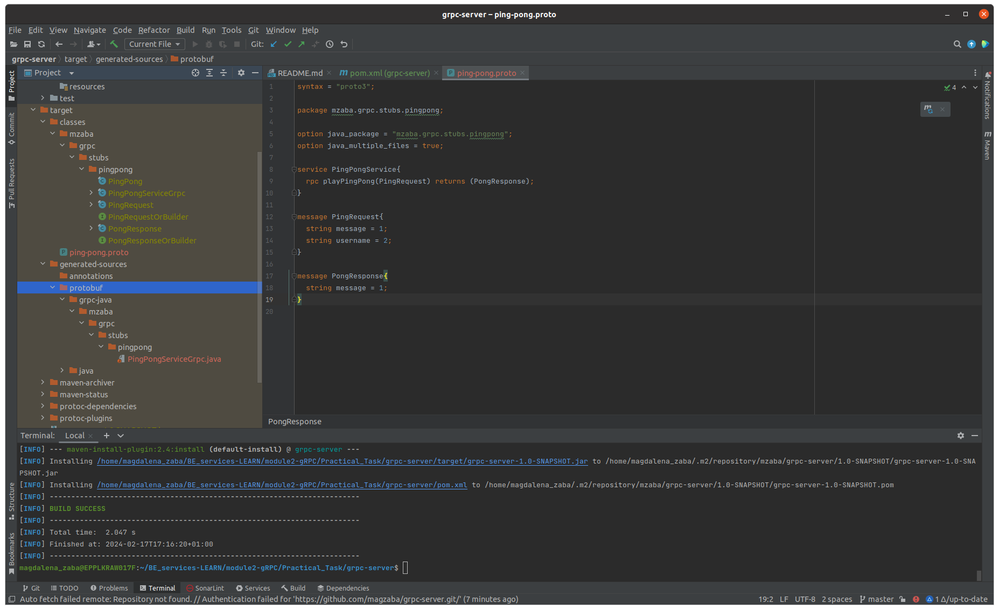
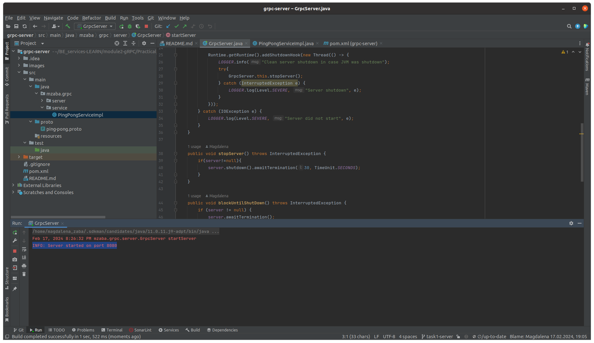
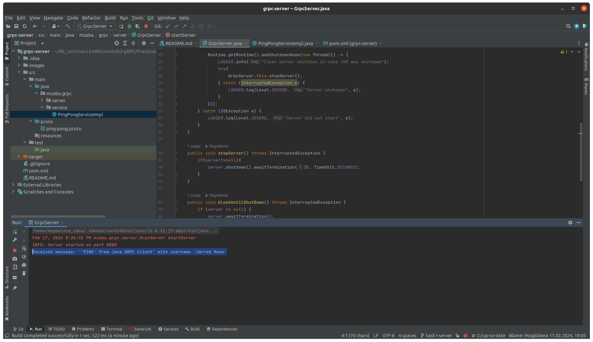
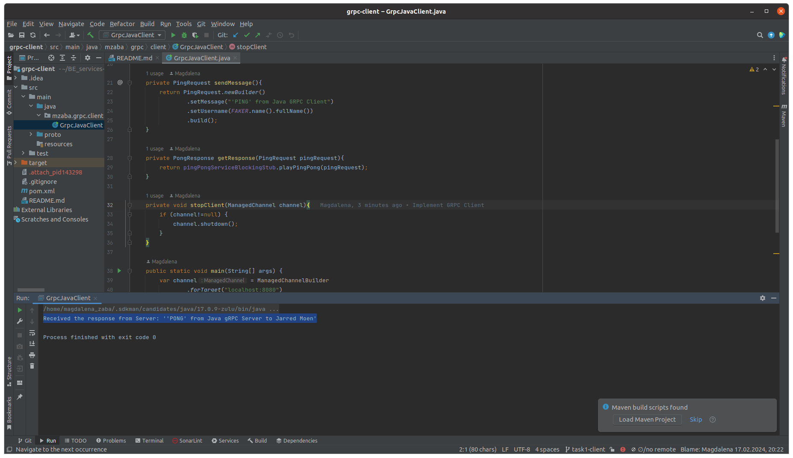
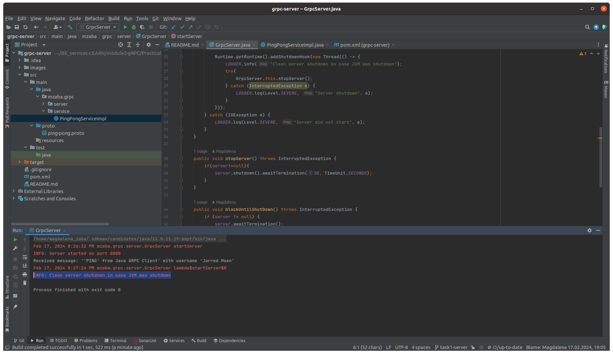

# grpc-server
This project is a practical task 1.1 for the course Java Advanced: Backend Services - Module 2 : RPC Protocols and Data Formats

## Description

The project is a simple gRPC server application that listens on port 8080 for a request like this:

`{ 
    "message": "Ping";
    "username": "Some User"
}`

And responses with

`{
"message": "Pong"
}`

### Task 1.1 - Server Application
 - Basic gRPC server application is created with the usage of Protocol Buffers.
 - Based on `ping-pong.proto` file, the following stubs have been generated

 - `PingPongServiceImpl` service is implemented
 - `GrpcServer` is created to listen on 8080 port

#### Task 1.4 - Application Test
- the server has been started

  

- the client has been started
- message received by server

  

- message received by client

  
 
- the server has been shutdown 

  
